# Wei-Cheng Tseng (104061146)</span>


# HW 3: Scene recognition with bag of words

## Overview
The project is about scene recognition. In this work, we are going to complete task of scene recognition with very simple methods first, i.e. tiny images and nearest neighbor classification. Later, we will finish state-of-the-art scene recognition, i.e. bags of quantized local features and linear classifiers learned by support vector machines.

After completing above implementation, we will look into the difference of accuracy of each method, and compared with different parameters.


## Implementation
We introduce our method in the following section. `get_tiny_images.py` and `nearest_neighbor_classify.py` is more simple example, `build_vocabulary.py` and `get_bags_of_sifts.py` is more complex image representation example, and `svm_classify.py` is the classifier which is more accuracy than nearest neighbor classifier.

### 1. Get tiny image
First, we resize the original image to 16 * 16 with `Image.resize()`, which I test that its accuracy is the highest. Then we flatten the 2D image into 1D numpy array with `np.reshape()`, and make sure our tiny image is zero mean and unit length.

```python
N, new_size = len(image_paths), 16
tiny_images = np.zeros((N, new_size*new_size))

for i in range(0, N):
    img = Image.open(image_paths[i])
    img = img.resize((new_size, new_size), PIL.Image.BICUBIC)
    img_reshape = np.reshape(img,(-1, new_size*new_size))
    tiny_images[i] = img_reshape - np.mean(img_reshape)
    tiny_images[i] = tiny_images[i] / np.linalg.norm(tiny_images[i])
```

### 2. Nearest neighbor classify
The `Nearest-Neighbor` classifier is to find out the smallest distance between the features of train data and test data. We regard the label of the nearest image as the predicted label of the testing data.

```python
N, M = len(train_image_feats), len(test_image_feats)

dist = distance.cdist(test_image_feats, train_image_feats,'euclidean')
min_dis, test_predicts = np.argmin(dist,axis=1), []

for i in range(0, M):
    test_predicts.append(train_labels[min_dis[i]])
```

### 3. Build vocabulary
To get bags of SIFT features, we build the vocabulary first. We apply `dsift()` to extract SIFT features, and cluster them with K-means to find out the SIFT features from training images. Afterward, we save the vocabulary so that we can reuse it.

```python
bag_of_features = []

for path in image_paths:
    img = np.asarray(Image.open(path),dtype='float32')
    frames, descriptors = dsift(img, step=[5,5], fast=True)
    bag_of_features.append(descriptors)
bag_of_features = np.concatenate(bag_of_features, axis=0).astype('float32')

vocab = kmeans(bag_of_features, vocab_size, initialization="PLUSPLUS")        
```
### 4. Get bags of sifts
In the previous section, we get the vocabulary of training images, so we can extract the SIFT features with the same method, `dsift()`, too. First we calculate the distance between testing images feature and vocabulary feature, according to the smallest distance and record how many times that each cluster was used with histogram. Later, the histogram should be normalized so that image size won't influence the histogram magnitude.(note: to prevent zero division error, we add make histogram as initial when normalization is zero)

```python
with open('vocab.pkl', 'rb') as vocab_file:
    vocab = pickle.load(vocab_file)

N, image_feats = len(vocab), []

for i, path in enumerate(image_paths):
    img = np.asarray(Image.open(path),dtype='float32')
    _, descriptors = dsift(img, step=[5,5], fast=True)
    feat_dists = distance.cdist(vocab, descriptors, 'euclidean')
    feat_dist_idx = np.argmin(feat_dists, axis=0)
    hist, _ = np.histogram(feat_dist_idx, bins=np.arange(N+1))
    norm = np.linalg.norm(hist)

    if norm == 0:
        image_feats.append(hist)
    else:
        image_feats.append(hist / norm)
```

### 5. SVM classify
In this section, I use the `LinearSVC` to complete function. 
Besides, we also implement the kernel SVM and use `kernel` to select the mode.

```python
if kernel is None:
    classifier = LinearSVC(C=1.0, class_weight=None, dual=True, fit_intercept=True,\
                            intercept_scaling=1, loss='squared_hinge', max_iter=1000,
                            multi_class='ovr', penalty='l2', random_state=0, 
                            tol=1e-05, verbose=0)
elif kernel == 'rbf':
    classifier =  sklearn.svm.SVC(kernel='rbf', 
                                    random_state=1, 
                                    gamma=1, C=10)
classifier.fit(train_image_feats, train_labels)
pred_label = []
pred_label = classifier.predict(test_image_feats)
```
### Extra Credit

* Accuracy with different vocabulary sizes.

    |vocab size|10|20|50|100|200|400|
    |:-:|:-:|:-:|:-:|:-:|:-:|:-:|
    |Nearest neighbor classify|0.402|0.455|0.498|0.513|0.540|0.555|
    |SVM (C=1.0)|0.492|0.565|0.621|0.671|0.702|0.719|
    |SVM (kernel=rbf)|0.528|0.596|0.650|0.685|0.711|0.740|

    In general, large vocab_size will lead to better preformance.

* kernel SVM (mentioned above)
* my public repo 

## Installation
* 3.6 python version 
* `sklearn` package is needed

## Results

With vocab=400

|Methods|Matrix|Accuracy|
|:-:|:-:|:-:|
|Dummy||0.067|
|Tiny Images with Nearest neighbor classify||0.230|
|Tiny Images with SVM classify||0.223|
|Bags of SIFT with Nearest neighbor classify||0.555|
|Bags of SIFT with LinearSVM classify||0.719|
|Bags of SIFT with RBF SVM classify||0.740|


## Visualization
| Category name | Sample training images | Sample true positives | False positives with true label | False negatives with wrong predicted label |
| :-----------: | :--------------------: | :-------------------: | :-----------------------------: | :----------------------------------------: |
| Kitchen |  |  |  | 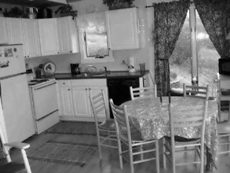 |
| Store |  | 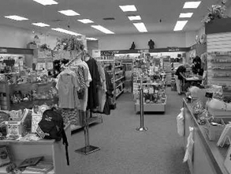 | 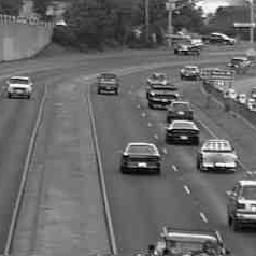 |  |
| Bedroom |  |  |  |  |
| LivingRoom |  |  |  | 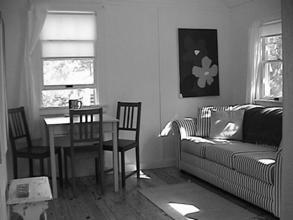 |
| Office |  |  |  |  |
| Industrial |  |  | 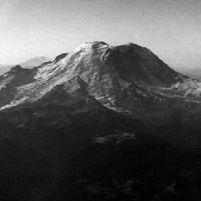 |  |
| Suburb | 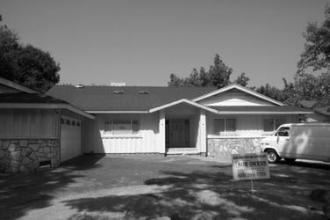 |  | 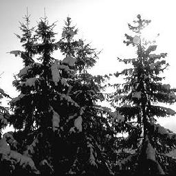 | 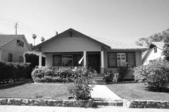 |
| InsideCity |  |  |  |  |
| TallBuilding | 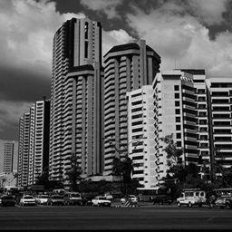 |  | 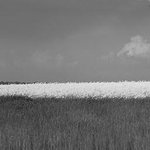 | 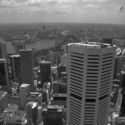 |
| Street |  |  |  |  |
| Highway |  |  | 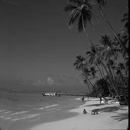 |  |
| OpenCountry |  | 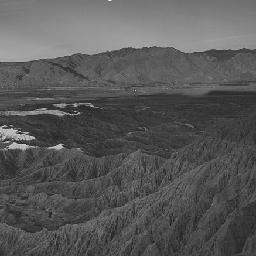 | 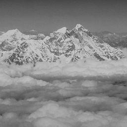 |  |
| Coast |  | 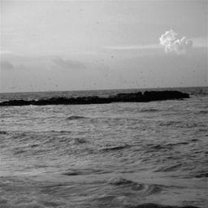 | 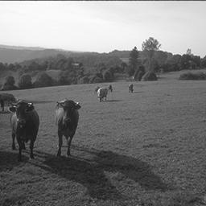 | 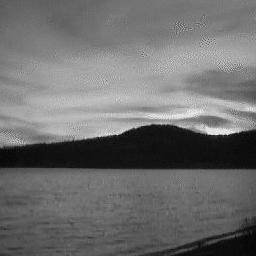 |
| Mountain | 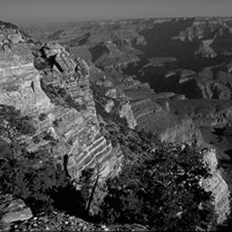 |  | 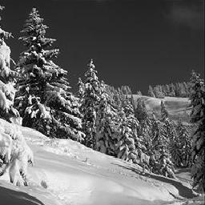 |  |
| Forest | 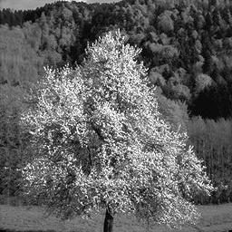 |  |  |  |
